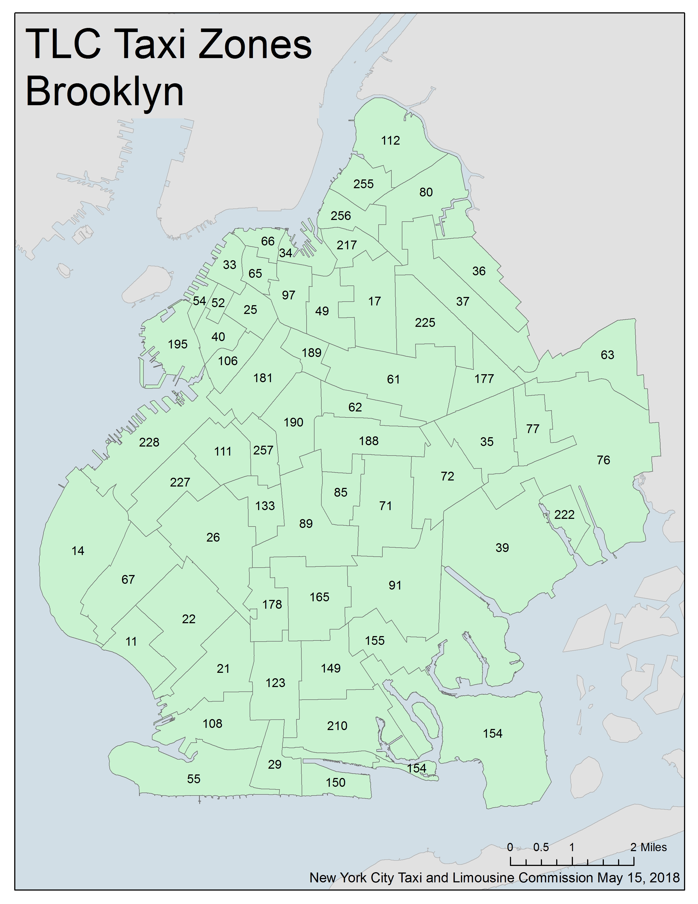
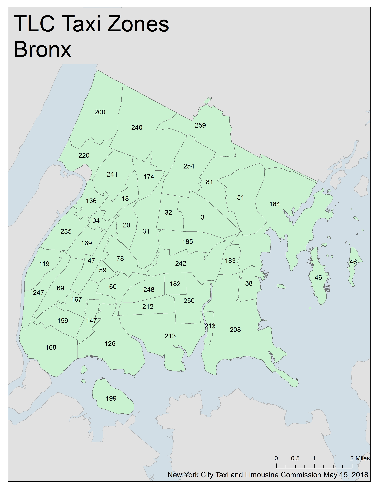

# NYC-TLC Data Engineering

New York City Taxi and Limousine Commission (TLC) Trip Record Data is loaded from AWS S3 into Redshift 
using Apache Airflow.

## Project scope

Trip and location data was obtained from a publicly available [S3 Bucket](https://s3.console.aws.amazon.com/s3/buckets/nyc-tlc/?region=eu-central-1) 
Data was gathered and moved to Redshift using a custom  Airflow Operator where it was transformed to an appropriate 
schema for analytics purposes. The main purpose of this exercise is to provide a mechanism for querying and sorting the
large volume of trip logs on a monthly basis by taxi zone and NYC borough. This data can then be used to redistribute 
vehicles appropriately where needed.

This project uses Apache Airflow to automate and orchestrate ETL and data analysis tasks on new data as it becomes 
available on a monthly basis. Amazon S3 is where the source data resides. A second S3 bucket was made for the purpose of 
showcasing the ability of airflow and redshift to source multiple data sources and formats easily. AWS Redshift is used 
because it is fast, with high performance and is horizontally scalable with  massive storage capacity. 
For reference, it takes approximately 2 minutes in order to move the 21 million rows (1.6 GB) of the fhvhv rides table 
from S3 to Redshift. 

##### Taxi zone map of Brooklyn

## Project investigation

The New York City Taxi and Limousine Commission [(NYC-TLC)](https://www1.nyc.gov/site/tlc/about/tlc-trip-record-data.page), 
created in 1971, is the agency responsible for licensing and 
regulating New York City's medallion (yellow) taxis,street hail livery (green) taxis, for-hire  vehicles  (FHVs), 
commuter vans,  and  para-transit  vehicles.The  TLC  collects trip  record information for each taxi and for-hire 
vehicle trip completed by our licensed drivers and vehicles. We  receive  taxi  trip  data  from the  technology service
providers (TSPs)  that provide  electronic metering  in  each  cab,  and  FHV trip data  from  the  app,  community 
livery,  black  car,  or  luxury limousine company, or base, who dispatched the trip.

In each trip record dataset, one row represents a single trip made by a TLC-licensed vehicle.
There are five major data sources that are used, dating from 2009 until present. 
See the [user guide](https://www1.nyc.gov/assets/tlc/downloads/pdf/trip_record_user_guide.pdf) for this and more 
information.

#### Yellow taxi trips

Trips made by New York City’s iconic yellow taxis have been recorded and provided to the TLC since 2009. 
Yellow taxis are traditionally hailed by signaling to a driver who is on duty and seeking a passenger (street hail), 
but now they may also be hailed using an e-hail app like Curb or Arro. Yellow taxis are the only vehicles permitted to 
respond to a street hail from a passenger in all five boroughs. 
Records include fields capturing pick-up and drop-off dates/times, pick-up and drop-off locations, trip distances, 
itemized fares, rate types, payment types, and driver-reported passenger counts. 
The records were  collected  and  provided  to  the  NYC  Taxi  and  Limousine  Commission  (TLC)  by technology service 
providers. The trip  data  was  not  created  by  the  TLC,  and  TLC cannot guarantee their accuracy.
The [yellow taxi data dictionary](https://data.cityofnewyork.us/api/views/biws-g3hs/files/eb3ccc47-317f-4b2a-8f49-5a684b0b1ecc?download=true&filename=data_dictionary_trip_records_yellow.pdf) 
can be downloaded for further reference.

#### Green taxi trips

Green taxis, also known as boro taxis and street-hail liveries, were introduced in August of 2013 to improve   taxi   
service   and   availability   in   the boroughs. Green taxis may respond to street hails, but  only  in  the  areas  
indicated  in green  on  the map (i.e. above W 110 St/E 96thSt in Manhattan and in the boroughs).Records  include  
fields  capturing  pick-up  and drop-off    dates/times,    pick-up    and    drop-off locations,   trip   distances,   
itemized   fares,   rate types,    payment    types,    and    driver-reported passenger  counts.  As  with  the  yellow  
taxi  data, these  records  were  collected  and  provided  to the NYC Taxi and Limousine Commission (TLC) by technology 
service  providers. 
The [green taxi data dictionary](https://data.cityofnewyork.us/api/views/hvrh-b6nb/files/65544d38-ab44-4187-a789-5701b114a754?download=true&filename=data_dictionary_trip_records_green.pdf) 
can be downloaded for further reference.

#### For-hire vehicle (FHV) trips
 
FHV  data  includes  trip  data  from  high-volume  for-hire  vehicle  bases  (bases for  companies dispatching  10,000+
trip  per  day,  meaning  Uber,  Lyft,  Via,  and  Juno),  community  livery  bases, luxury limousine bases, and black 
car bases. The TLC began receiving FHV trip data from bases in 2015, but the amount of information that has been 
provided  has  changed  over  time.  In 2015,  only  the  dispatching  base  number,  pickup datetime, and the 
location of the pickup (see section on matching zone IDs below) were provided 
4to  the  TLC.  In  summer  of  2017,  the  TLC  mandated  that  the  companies  provide  the  drop-off date/time 
and the drop-off location. In 2017, the TLC also started to receive information on shared rides, like those offered 
in services like Lyft Line and Uber Pool. A trip is only considered shared if it was reserved specially with one of 
these services. See note below for more information on shared rides. After the high volume license type was created 
in February 2019, a high-volume license number was added. These are called FHVHV trips.
This is an overall identifier for app companies who may have multiple base licenses.  
The [FHV data dictionary](https://data.cityofnewyork.us/api/views/am94-epxh/files/0341cc01-520a-49eb-bc3c-94f6c35c6355?download=true&filename=data_dictionary_trip_records_fhv.pdf) 
and [FHVHV data dictionary](https://www1.nyc.gov/assets/tlc/downloads/pdf/data_dictionary_trip_records_hvfhs.pdf)
can be downloaded for further reference.

#### Taxi zone lookup table

Each of the trip records contains a field corresponding to the location of the pickup or drop-off of the trip 
(or in FHV records before 2017, just the pickup), populated by numbers ranging from 1-263. 
These numbers correspond to taxi zones, which may be downloaded as a table or map/shapefile and matched to the trip 
records using a join. 
The data is currently available on the [Open Data Portal](https://data.cityofnewyork.us/Transportation/NYC-Taxi-Zones/d3c5-ddgc)
, or on the  trip records    page on    the [TLC website](https://www1.nyc.gov/site/tlc/about/tlc-trip-record-data.page)
, under Taxi Zone Maps and Lookup Tables. 

##### Taxi zone map of Bronx

 
 ## Data investigation
 
Only data from 2019 onwards will be considered because of the recent changes in February 2019.
 Data for each taxi type is stored in a CSV file for each  month in  the **'trip data'** folder. 
 Information about the different taxi zones and borough maps are located in the **'misc'** folder.
 A duplicate taxi zones table was uploaded to a [public S3 bucket](https://s3.console.aws.amazon.com/s3/buckets/nyc-tlc-udacity/) 
 in JSON format with a representative manifest file for reading it into Redshift. This was done to meet the project 
 specifications of multiple data source formats. 

 The data required for this project is of very high quality, however minor cleaning needed to be done while reading data 
 from S3 to Redshift. The trip data needed to be modified during the load step by including the following code in the 
 query: 
 `IGNOREHEADER 1
        delimiter ','
        IGNOREBLANKLINES
        REMOVEQUOTES
        EMPTYASNULL`.
 Secondly, a manifest file needed to be created to mediate loading of the taxi zones data.
 
 The following steps are performed by the DAG:
1. Staging tables are created using the PostgresOperator
2. A configured S3ToRedshiftOperator is used to move taxi zone data (JSON) and ride data (CSV) from S3 to redshift.
3. The first DataQualityOperator is used to validate that data has infact been populated into the staging tables.
4. The PostgresOperator is again used to create the final data model and edit the staging tables structure in 
preparation for merging.
5. The PostgresOperator is used to move data from the staging tables to the taxi_rides table and create the time table.
6. The second DataQualityOperator is used to check that the final tables have been populated as expected.
7. The DataAnalysisOperator is used to run analytics queries on the data model.

The purpose of the final data model is to have a table which allows ad hoc queries regarding the number and total income
of each borough for taxis and is joined to avoid having to join the green and yellow taxi data at run time.
The model also included staging tables for fhv and fhvhv rides which can be queried to 
determine the number of rides per ride type per borough.

### Further considerations
If the following scenarios occur, the effect on the project will be as follows:
1.    The data was increased by 100x.

    - Redshift is configured to scale horizontally so increasing the data would only increase the amount of time taken 
    for data to be moved from s3 to redshift and for queries, but the affect would be minimal.
    
2.    The pipelines would be run on a daily basis by 7 am every day.

    - Airflow can easily be configured to run on a daily schedule and the Redshift cluster would need to be up daily 
    instead of monthly which would incur a greater cost. However, given that data is only uploaded once a month, it 
    would make more sense to move the data to regular database system for cost sake. 
    
3.    The database needed to be accessed by 100+ people.

    - Redshift is able to cope with high traffic volumes without affecting performance. 

  
 